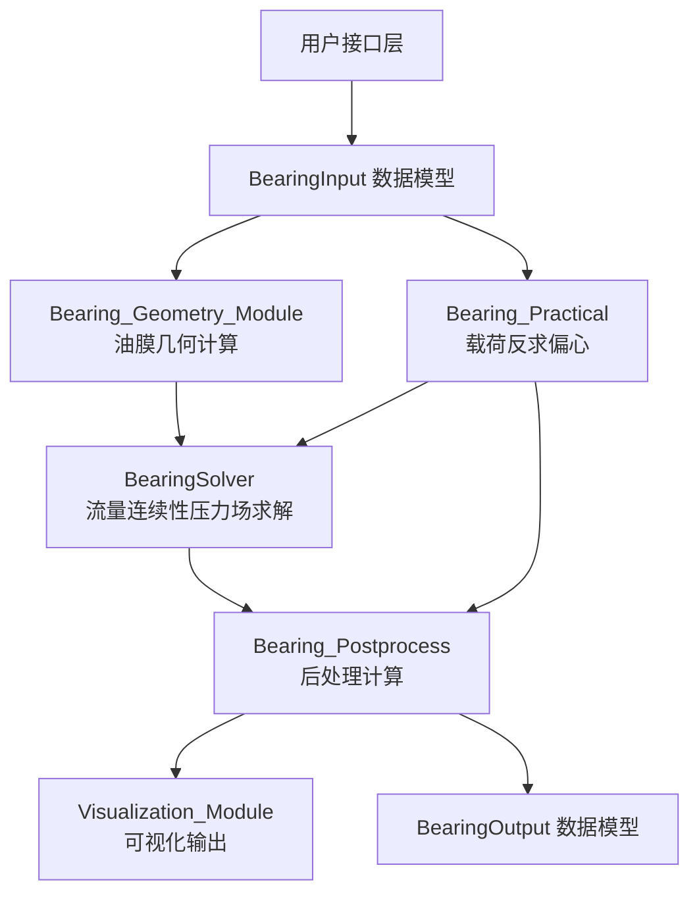
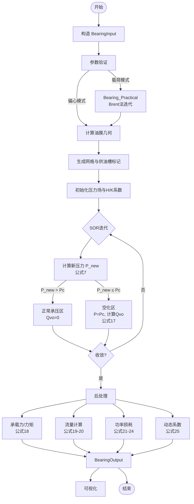

# 技术设计文档 — 滑动轴承流体动力学分析程序

## 概述

本程序实现 Jakeman (1984) 论文提出的基于流量连续性（flow continuity）的滑动轴承水动力润滑数值分析方法。与传统 Reynolds 方程有限差分法不同，Jakeman 方法对油膜网格的每个元素直接列质量守恒方程，通过引入空化流量项 Qvo 自动确定空化边界，无需预设空化区域。

### 核心设计决策

1. **算法选择**：采用 Jakeman 流量连续性方法（非传统 Reynolds 方程 FDM），核心在于公式(6-17)的实现
2. **技术栈**：Python 3.10+、NumPy（数值计算）、Matplotlib（可视化）、dataclass（数据模型）
3. **单位制**：全程使用 SI 单位（m, s, Pa, rad）
4. **接口分层**：简单接口 `analyze_bearing()` 面向工程师，高级接口 `BearingInput + BearingSolver` 面向开发者

### 与传统方法的关键区别

| 特性 | 传统 Reynolds FDM | Jakeman 流量连续性 |
|------|-------------------|-------------------|
| 基本方程 | 离散化 Reynolds 方程 | 每个网格元素的质量守恒 |
| 空化处理 | 设负压为零（非物理） | Qvo 流量传递（物理合理） |
| 边界条件 | 需预设空化边界 | 自动确定空化边界 |
| 流量守恒 | 不严格保证 | 严格保证 |

## 架构

### 高层架构

程序采用分层模块化架构，核心计算流程为：输入验证 → 几何计算 → 压力场求解 → 后处理 → 可视化/输出。



### 项目结构

```
jakeman_bearing/
├── __init__.py              # 包入口，导出 analyze_bearing 等公共接口
├── bearing_models.py        # 数据模型：BearingInput, BearingOutput, GrooveConfig
├── bearing_geometry.py      # 油膜几何计算（公式1-5）
├── bearing_solver.py        # 核心求解器（公式6-17）
├── bearing_postprocess.py   # 后处理：承载力、流量、功率、动态系数（公式18-25）
├── bearing_practical.py     # 实用模式：给定载荷求偏心（Brent法）
├── visualization.py         # Matplotlib 可视化
├── app.py                   # Streamlit Web 界面（主入口）
└── tests/
    ├── __init__.py
    ├── test_models.py       # 数据模型验证测试
    ├── test_geometry.py     # 几何计算测试
    ├── test_solver.py       # 求解器测试
    ├── test_postprocess.py  # 后处理测试
    ├── test_practical.py    # 实用模式测试
    ├── test_validation.py   # 论文数据验证测试
    └── test_properties.py   # 属性测试（property-based testing）
```

### 计算流程



## 组件与接口

### 1. bearing_models.py — 数据模型

#### GrooveConfig

```python
@dataclass
class GrooveConfig:
    groove_type: str                    # "circumferential_360" | "axial_dual" | "axial_single"
    angular_positions_deg: list[float]  # 槽角度位置列表（°）
    angular_width_deg: float            # 槽张角（°）
    supply_pressure_pa: float           # 供油压力（Pa）
    axial_position_ratio: float = 0.5   # 环形槽轴向位置比（0~1），仅 circumferential_360 使用
    axial_width_ratio: float = 0.05     # 环形槽轴向宽度比，仅 circumferential_360 使用
```

#### BearingInput

所有参数的默认值完整对应论文 Table 1 Case 1（曲轴轴承对齐工况，ε=0.6），用户零参数调用即可复现论文结果。

```python
@dataclass
class BearingInput:
    # ── 几何参数 ──────────────────────────────────────────────
    # 默认值 = 论文 Table 1 曲轴轴承: D=63.5mm, L=23.68mm, Cd=0.0635mm
    # 注: L=23.68mm 是有效长度（总长含5.08mm宽环形槽）
    diameter_m: float = 0.0635                  # 轴承内径（m）    参考范围: 0.05~2.0
    length_m: float = 0.02368                   # 轴承长度（m）    参考范围: 0.02~3.0
    clearance_m: float = 0.0000635              # 直径间隙（m）    参考范围: 0.00003~0.005
    
    # ── 工况参数 ──────────────────────────────────────────────
    # 默认值 = 论文 Table 1: N=2000rpm=33.33r/s, η=0.014 Pa·s
    speed_rps: float = 2000.0 / 60.0           # 转速（r/s）      参考范围: 0.1~100
    viscosity_pa_s: float = 0.014               # 动力粘度（Pa·s） 参考: 矿物油0.01~0.5
    
    # ── 偏心模式（二选一，默认偏心模式）────────────────────────
    # 默认值 = 论文 Table 1 Case 1: ε=0.6
    eccentricity_ratio: float | None = 0.6      # 偏心比（0~1）    典型值: 0.3~0.8
    attitude_angle_rad: float = 0.0             # 偏位角（rad）    通常由求解器自动计算
    
    # ── 载荷模式（设为 None 表示不使用载荷模式）────────────────
    load_n: float | None = None                 # 载荷（N）        参考: Table 3 约 770,000N
    load_direction_deg: float = 270.0           # 载荷方向（°）    270°=正下方（重力方向）
    
    # ── 不对中参数 ────────────────────────────────────────────
    # 默认值 0 = 对齐轴承（Table 1 为对齐工况）
    misalignment_vertical_rad: float = 0.0      # 垂直面倾斜角 γ（rad）  参考: 0~0.001
    misalignment_horizontal_rad: float = 0.0    # 水平面倾斜角 λ（rad）  参考: 0~0.001
    
    # ── 压力参数 ──────────────────────────────────────────────
    cavitation_pressure_pa: float = 0.0         # 空化压力（Pa）   0=表压
    ambient_pressure_pa: float = 0.0            # 环境压力（Pa）   0=表压
    
    # ── 供油槽 ────────────────────────────────────────────────
    # 默认值 = 论文 Table 1 的 360°环形槽（Ps=0.2067MPa，轴承中部，宽5.08mm）
    # None 时自动使用此默认配置；显式传 GrooveConfig(groove_type="none") 可禁用
    groove: GrooveConfig | None = None          # None → 使用 Table 1 默认环形槽
    
    # ── 网格参数 ──────────────────────────────────────────────
    # 默认值 = 论文推荐: Mc=72（每5°一个网格），Na=10
    n_circumferential: int = 72                 # 周向网格数 Mc    参考: 36~144
    n_axial: int = 10                           # 轴向网格数 Na    参考: 8~30
    axial_grading_factor: float = 1.0           # 轴向加密因子     1.0=均匀，>1端部加密
    
    # ── 求解器参数 ────────────────────────────────────────────
    over_relaxation_factor: float = 1.7         # SOR 松弛因子     参考: 1.2~1.9
    max_iterations: int = 5000                  # 最大迭代次数     参考: 1000~20000
    convergence_tol: float = 1.0                # 收敛容差（Pa）   参考: 0.1~10.0
    
    def validate(self) -> None:
        """验证所有输入参数，无效时抛出 ValueError"""
        ...
    
    @staticmethod
    def default_groove() -> 'GrooveConfig':
        """返回论文 Table 1 的默认供油槽配置"""
        return GrooveConfig(
            groove_type="circumferential_360",
            angular_positions_deg=[0],
            angular_width_deg=360,
            supply_pressure_pa=206700,      # 0.2067 MPa
            axial_position_ratio=0.5,       # 轴承中部
            axial_width_ratio=0.2145        # 5.08mm / 23.68mm
        )
```

#### 零参数运行的预期输出

用户直接调用 `result = analyze_bearing()` 将使用论文 Table 1 Case 1 的全部参数，预期输出应与论文结果一致（承载力误差 < 3%，偏位角误差 < 2°）。

#### GrooveConfig 典型配置参考

```python
# 曲轴轴承：360°环形槽（论文 Table 1 — 即默认配置）
groove_crankshaft = GrooveConfig(
    groove_type="circumferential_360",
    angular_positions_deg=[0],
    angular_width_deg=360,
    supply_pressure_pa=206700,          # 0.2067 MPa
    axial_position_ratio=0.5,
    axial_width_ratio=0.2145            # 5.08mm / 23.68mm
)

# 尾管轴承：双轴向槽（论文 Table 2/3）
groove_sterntube = GrooveConfig(
    groove_type="axial_dual",
    angular_positions_deg=[90, 270],    # 90°和270°位置
    angular_width_deg=30,               # 张角30°
    supply_pressure_pa=101325           # 约1个大气压
)

# 禁用供油槽
groove_none = GrooveConfig(groove_type="none", angular_positions_deg=[], angular_width_deg=0, supply_pressure_pa=0)
```

#### BearingOutput

```python
@dataclass
class BearingOutput:
    # 压力场与空化
    pressure_field_pa: np.ndarray               # 压力场（Mc × Na）
    cavitation_matrix: np.ndarray               # 空化标记（bool, Mc × Na）
    film_thickness_field_m: np.ndarray          # 油膜厚度场（Mc × Na）
    
    # 承载力
    load_capacity_n: float                      # 合成承载力（N）
    load_vertical_n: float                      # 垂直分量 Fy（N）
    load_horizontal_n: float                    # 水平分量 Fx（N）
    attitude_angle_deg: float                   # 偏位角（°）
    
    # 力矩（不对中时）
    moment_vertical_nm: float                   # 垂直力矩 My（N·m）
    moment_horizontal_nm: float                 # 水平力矩 Mx（N·m）
    
    # 油膜
    min_film_thickness_m: float                 # 最小油膜厚度（m）
    min_film_location: tuple[float, float]      # 最薄处位置（θ°, s_mm）
    
    # 流量
    side_leakage_flow_m3s: float                # 侧漏流量（m³/s）
    
    # 功率
    power_loss_w: float                         # 功率损耗（W）
    friction_force_n: float                     # 摩擦力（N）
    
    # 动态系数
    stiffness_coefficients: np.ndarray          # 刚度系数矩阵
    damping_coefficients: np.ndarray            # 阻尼系数矩阵
    
    # 求解器信息
    iterations: int                             # 实际迭代次数
    converged: bool                             # 是否收敛
    residual: float                             # 最终残差
    
    # 输入回显
    input_params: BearingInput                  # 输入参数引用
    
    def summary(self) -> str:
        """生成文本摘要"""
        ...
    
    def to_csv(self, filepath: str) -> None:
        """保存压力场和性能参数为 CSV"""
        ...
```

### 2. bearing_geometry.py — 油膜几何计算

```python
def compute_eccentricity_components(
    ecy: float, ecx: float,
    gamma: float, lam: float,
    s_positions: np.ndarray
) -> tuple[np.ndarray, np.ndarray]:
    """
    计算轴向各位置的偏心分量（公式4-5）
    
    参数:
        ecy: 中心垂直偏心分量（m）
        ecx: 中心水平偏心分量（m）
        gamma: 垂直面倾斜角（rad）
        lam: 水平面倾斜角（rad）
        s_positions: 轴向位置数组（m），以轴承中心为原点
    
    返回:
        (esy_array, esx_array): 各轴向位置的偏心分量
    """
    ...

def compute_film_thickness(
    clearance_m: float,
    e_array: np.ndarray,
    psi_array: np.ndarray,
    theta_positions: np.ndarray
) -> np.ndarray:
    """
    计算油膜厚度场（公式1）
    h = Cd/2 + e(s) × cos(θ - ψ(s))
    
    返回:
        film_thickness: 二维数组 (n_theta × n_axial)
    """
    ...

def compute_element_corner_thicknesses(
    clearance_m: float,
    e_array: np.ndarray,
    psi_array: np.ndarray,
    theta_edges: np.ndarray,
    s_edges: np.ndarray
) -> tuple[np.ndarray, np.ndarray, np.ndarray, np.ndarray]:
    """
    计算每个网格元素四角的油膜厚度 ha, hb, hc, hd
    
    ha: (θ_J, s_I)       — 上游内侧角
    hb: (θ_J, s_{I+1})   — 上游外侧角
    hc: (θ_{J+1}, s_I)   — 下游内侧角
    hd: (θ_{J+1}, s_{I+1}) — 下游外侧角
    
    返回:
        (ha, hb, hc, hd): 各为 (Mc × Na) 数组
    """
    ...
```

### 3. bearing_solver.py — 核心求解器

```python
class BearingSolver:
    """基于 Jakeman 流量连续性方法的压力场求解器"""
    
    def __init__(self, bearing_input: BearingInput):
        self.input = bearing_input
        self._setup_grid()
        self._setup_groove_mask()
    
    def _setup_grid(self) -> None:
        """初始化网格：θ坐标、s坐标、Δa、Δc"""
        ...
    
    def _setup_groove_mask(self) -> None:
        """根据 GrooveConfig 生成供油槽掩码矩阵"""
        ...
    
    def _compute_H_coefficients(
        self, ha: np.ndarray, hb: np.ndarray,
        hc: np.ndarray, hd: np.ndarray
    ) -> tuple[np.ndarray, np.ndarray, np.ndarray, np.ndarray]:
        """
        计算压力流函数 Hci, Hai, Hco, Hao（公式8-11）
        
        Hci = (ha+hb)³ × Δa / (96 × η × Δc)
        Hai = (ha+hc)³ × Δc / (96 × η × Δa)
        Hco = (hc+hd)³ × Δa / (96 × η × Δc)
        Hao = (hb+hd)³ × Δc / (96 × η × Δa)
        
        边界相邻网格的 H 系数 ×2
        """
        ...
    
    def _compute_K_flow(
        self, ha: np.ndarray, hb: np.ndarray,
        hc: np.ndarray, hd: np.ndarray
    ) -> np.ndarray:
        """
        计算速度诱导流量 K（公式12-16）
        稳态: K = (hc + hd - ha - hb) × U × Δa / 4
        其中 U = π × D × N
        """
        ...
    
    def solve(
        self,
        ecy: float | None = None,
        ecx: float | None = None
    ) -> BearingOutput:
        """
        执行压力场迭代求解
        
        算法流程:
        1. 计算油膜几何（ha, hb, hc, hd）
        2. 计算 H 系数和 K 流量
        3. SOR 迭代:
           a. 对每个非供油槽网格，用公式(7)计算 P_new
           b. 若 P_new ≤ Pc: 标记空化，P=Pc，计算 Qvo（公式17）
           c. 若 P_new > Pc: 正常承压，Qvo=0
           d. 将 Qvo 传递给下游网格作为 Qvi
           e. SOR 松弛: P = P_old + ORF × (P_new - P_old)
        4. 检查收敛: max|P_new - P_old| < tol
        5. 调用后处理计算性能参数
        """
        ...
    
    def solve_perturbed(
        self,
        ecy: float, ecx: float,
        delta_ecy: float = 0.0,
        delta_ecx: float = 0.0,
        delta_ecy_dot: float = 0.0,
        delta_ecx_dot: float = 0.0
    ) -> np.ndarray:
        """
        求解扰动后的压力场，用于动态系数计算
        """
        ...
```

### 4. bearing_postprocess.py — 后处理

```python
def compute_load_capacity(
    pressure_field: np.ndarray,
    theta_centers: np.ndarray,
    delta_a: np.ndarray,
    delta_c: float
) -> tuple[float, float, float, float]:
    """
    计算承载力（公式18，12点加权平均）
    
    返回:
        (Fy, Fx, F_total, attitude_angle_deg)
    """
    ...

def compute_moments(
    pressure_field: np.ndarray,
    theta_centers: np.ndarray,
    s_centers: np.ndarray,
    delta_a: np.ndarray,
    delta_c: float
) -> tuple[float, float]:
    """
    计算力矩 My, Mx
    """
    ...

def compute_side_leakage(
    pressure_field: np.ndarray,
    H_ao: np.ndarray,
    H_ai: np.ndarray,
    ambient_pressure: float
) -> float:
    """
    计算侧漏流量（公式19-20）
    """
    ...

def compute_power_loss(
    pressure_field: np.ndarray,
    film_thickness: np.ndarray,
    viscosity: float,
    surface_velocity: float,
    delta_a: np.ndarray,
    delta_c: float,
    cavitation_matrix: np.ndarray
) -> tuple[float, float]:
    """
    计算功率损耗（公式21-24）
    
    返回:
        (power_loss_w, friction_force_n)
    """
    ...

def compute_dynamic_coefficients(
    solver: 'BearingSolver',
    ecy: float, ecx: float,
    is_misaligned: bool
) -> tuple[np.ndarray, np.ndarray]:
    """
    计算动态刚度/阻尼系数（公式25）
    
    对齐: 8个系数 (2×2 刚度 + 2×2 阻尼)
    不对中: 32个系数 (4×4 刚度 + 4×4 阻尼)
    
    方法: 对 ecy, ecx (及不对中时 γ, λ) 施加微小扰动 δ，
          重新求解压力场，差分计算:
          Aij = (Fi(+δ) - Fi(-δ)) / (2δ)
          Bij = (Fi(+δ̇) - Fi(-δ̇)) / (2δ̇)
    """
    ...
```

### 5. bearing_practical.py — 实用分析模式

```python
def solve_for_load(
    bearing_input: BearingInput,
    target_load_n: float,
    load_direction_deg: float,
    tol: float = 0.01,
    max_iter: int = 50
) -> BearingOutput:
    """
    给定载荷反求偏心距（Brent法）
    
    算法:
    1. 初始偏心比 ε₀ = 0.5
    2. 调用 BearingSolver.solve() 计算承载力
    3. 定义目标函数 f(ε) = F_computed - F_target
    4. 使用 Brent 法在 [0.01, 0.99] 区间搜索零点
    5. 同时迭代偏位角以匹配载荷方向
    6. 收敛后返回完整 BearingOutput
    """
    ...
```

### 6. visualization.py — 可视化

```python
def plot_pressure_3d(output: BearingOutput, save_path: str | None = None) -> None:
    """3D 压力分布图"""
    ...

def plot_pressure_contour(output: BearingOutput, save_path: str | None = None) -> None:
    """压力等值线图"""
    ...

def plot_cavitation_map(output: BearingOutput, save_path: str | None = None) -> None:
    """空化区域图"""
    ...

def plot_film_thickness(output: BearingOutput, save_path: str | None = None) -> None:
    """油膜厚度分布图"""
    ...

def plot_pressure_profile(
    output: BearingOutput,
    axial_index: int | None = None,
    save_path: str | None = None
) -> None:
    """截面压力曲线"""
    ...

def plot_journal_center(output: BearingOutput, save_path: str | None = None) -> None:
    """轴心位置图"""
    ...
```

### 7. 公共接口 — __init__.py

```python
def analyze_bearing(
    diameter: float = 0.0635,                   # 轴承内径（m），默认=Table 1: 63.5mm
    length: float = 0.02368,                    # 轴承长度（m），默认=Table 1: 23.68mm
    clearance: float = 0.0000635,               # 直径间隙（m），默认=Table 1: 0.0635mm
    speed_rps: float = 2000.0 / 60.0,          # 转速（r/s），默认=Table 1: 2000rpm
    viscosity: float = 0.014,                   # 粘度（Pa·s），默认=Table 1
    eccentricity_ratio: float | None = 0.6,     # 偏心比，默认=Table 1 Case 1: 0.6
    load: float | None = None,                  # 载荷（N），设值则切换为载荷模式
    load_direction: float = 270.0,              # 载荷方向（°），270°=正下方
    misalignment_vertical: float = 0.0,         # 垂直不对中（rad），0=对齐
    misalignment_horizontal: float = 0.0,       # 水平不对中（rad），0=对齐
    groove_type: str | None = "circumferential_360",  # 供油槽类型，默认=Table 1 环形槽
    groove_positions: list[float] | None = None, # 槽角度位置
    groove_width: float = 360.0,                # 槽张角（°）
    supply_pressure: float = 206700.0,          # 供油压力（Pa），默认=Table 1: 0.2067MPa
    n_circumferential: int = 72,                # 周向网格数
    n_axial: int = 10,                          # 轴向网格数
    **kwargs
) -> BearingOutput:
    """
    简单接口：所有参数默认为论文 Table 1 Case 1，零参数即可复现论文结果
    
    零参数运行（复现论文 Table 1 Case 1）:
        result = analyze_bearing()
        print(result.summary())
    
    尾管轴承不对中分析（论文 Table 3）:
        result = analyze_bearing(
            diameter=0.8, length=1.2, clearance=0.0014,
            speed_rps=80/60, viscosity=0.125,
            load=770000, eccentricity_ratio=None,
            misalignment_vertical=0.0002,
            groove_type="axial_dual",
            groove_positions=[90, 270], groove_width=30,
            supply_pressure=101325
        )
    """
    ...
```

### 8. Web 界面 — app.py（Streamlit）

```python
# 启动方式: streamlit run jakeman_bearing/app.py

import streamlit as st
from jakeman_bearing import analyze_bearing

# 页面配置
st.set_page_config(page_title="船舶轴承分析", layout="wide")
st.title("🚢 船舶滑动轴承流体动力学分析")
st.caption("基于 Jakeman (1984) 流量连续性方法")

# 侧边栏：预设工况快速选择
preset = st.sidebar.selectbox("📋 预设工况", [
    "论文 Table 1 — 曲轴轴承（默认）",
    "论文 Table 3 — 尾管轴承",
    "自定义参数"
])

# 侧边栏：输入参数分组（带默认值，单位用mm/rpm等工程师习惯单位）
with st.sidebar.expander("📐 轴承几何", expanded=True):
    diameter = st.number_input("轴承内径 D (mm)", value=63.5) / 1000
    length = st.number_input("轴承长度 L (mm)", value=23.68) / 1000
    clearance = st.number_input("直径间隙 Cd (μm)", value=63.5) / 1e6

with st.sidebar.expander("⚙️ 工况参数", expanded=True):
    speed_rpm = st.number_input("转速 (rpm)", value=2000.0)
    viscosity = st.number_input("粘度 (Pa·s)", value=0.014, format="%.4f")

# ... 更多分组: 偏心/载荷、不对中、供油槽、高级参数

# 计算按钮
if st.sidebar.button("🚀 开始计算", type="primary", use_container_width=True):
    with st.spinner("正在迭代求解..."):
        result = analyze_bearing(diameter=diameter, ...)
    
    # 主区域：性能参数卡片
    col1, col2, col3, col4 = st.columns(4)
    col1.metric("承载力", f"{result.load_capacity_n:.0f} N")
    col2.metric("偏位角", f"{result.attitude_angle_deg:.1f}°")
    col3.metric("最小油膜厚度", f"{result.min_film_thickness_m*1e6:.1f} μm")
    col4.metric("功率损耗", f"{result.power_loss_w:.1f} W")
    
    # 图表标签页
    tab1, tab2, tab3, tab4 = st.tabs(["压力分布", "空化区域", "油膜厚度", "截面曲线"])
    # ... 各标签页显示对应图表
    
    # 下载按钮
    st.download_button("📥 下载 CSV 数据", csv_data, "bearing_result.csv")
```

#### Web 界面布局示意

```
┌─────────────────────────────────────────────────────────────────┐
│  🚢 船舶滑动轴承流体动力学分析                                    │
│  基于 Jakeman (1984) 流量连续性方法                               │
├──────────────┬──────────────────────────────────────────────────┤
│ 侧边栏       │  主区域                                          │
│              │                                                  │
│ 📋 预设工况   │  ┌──────┬──────┬──────┬──────┐                  │
│ [Table 1 ▼]  │  │承载力 │偏位角│最小膜厚│功率损耗│                  │
│              │  └──────┴──────┴──────┴──────┘                  │
│ 📐 轴承几何   │                                                  │
│  D: [63.5]mm │  ┌─────────────────────────────┐                │
│  L: [23.68]mm│  │ [压力分布] [空化] [油膜] [曲线]│                │
│  Cd:[63.5]μm │  ├─────────────────────────────┤                │
│              │  │    (当前选中的图表)           │                │
│ ⚙️ 工况参数   │  └─────────────────────────────┘                │
│  N: [2000]rpm│                                                  │
│  η: [0.014]  │  📥 下载CSV  📥 下载图表                          │
│              │                                                  │
│ [🚀 开始计算] │  ── 详细结果摘要 ──                               │
└──────────────┴──────────────────────────────────────────────────┘
```

## 数据模型

### 网格坐标系

```
周向 θ: 0° → 360°（周期性）
  θ_J = (J - 0.5) × 360° / Mc,  J = 1, 2, ..., Mc
  θ 边界: θ_J_edge = (J - 1) × 360° / Mc

轴向 s: -L/2 → +L/2（以轴承中心为原点）
  均匀网格: s_I = -L/2 + (I - 0.5) × Δa,  I = 1, 2, ..., Na
  加密网格: 端部细、中部粗（grading_factor > 1）
```

### 网格元素与四角定义

```
        θ_J          θ_{J+1}
s_I     ┌─── ha ────── hc ───┐
        │                     │
        │    (J, I) 元素      │
        │                     │
s_{I+1} └─── hb ────── hd ───┘

ha = h(θ_J, s_I)         上游内侧
hb = h(θ_J, s_{I+1})     上游外侧
hc = h(θ_{J+1}, s_I)     下游内侧
hd = h(θ_{J+1}, s_{I+1}) 下游外侧
```

### 压力场数据流

```
输入: BearingInput
  ↓
几何: ha[Mc, Na], hb[Mc, Na], hc[Mc, Na], hd[Mc, Na]  — float64
  ↓
系数: Hci[Mc, Na], Hai[Mc, Na], Hco[Mc, Na], Hao[Mc, Na]  — float64
      K[Mc, Na]  — float64
  ↓
求解: P[Mc, Na]  — float64, 初始化为 ambient_pressure
      Qvo[Mc, Na]  — float64, 初始化为 0
      cavitation[Mc, Na]  — bool, 初始化为 False
      groove_mask[Mc, Na]  — bool, 供油槽标记
  ↓
输出: BearingOutput（含所有性能参数）
```

### 关键公式索引

| 公式编号 | 内容 | 所在模块 |
|---------|------|---------|
| (1) | 油膜厚度 h = Cd/2 + e(s)·cos(θ-ψ) | bearing_geometry |
| (2-3) | 合成偏心距 e(s), 偏位角 ψ(s) | bearing_geometry |
| (4-5) | 轴向偏心分量 esy(s), esx(s) | bearing_geometry |
| (6-7) | 流量连续性方程与压力求解 | bearing_solver |
| (8-11) | 压力流函数 Hci, Hai, Hco, Hao | bearing_solver |
| (12-16) | 速度诱导流量 K | bearing_solver |
| (17) | 空化流量 Qvo | bearing_solver |
| (18) | 12点加权平均承载力 | bearing_postprocess |
| (19-20) | 流量计算 | bearing_postprocess |
| (21-24) | 功率损耗 | bearing_postprocess |
| (25) | 动态系数（扰动法） | bearing_postprocess |


## 正确性属性（Correctness Properties）

*正确性属性是在系统所有有效执行中都应成立的特征或行为——本质上是对系统应做什么的形式化陈述。属性是人类可读规格说明与机器可验证正确性保证之间的桥梁。*

### Property 1: 输入验证拒绝无效参数

*For any* 偏心比值 ε ≤ 0 或 ε ≥ 1，以及任何非正的几何参数（diameter_m, length_m, clearance_m），BearingInput.validate() 应抛出 ValueError，且错误信息中包含参数名称和有效范围。

**Validates: Requirements 1.10, 1.11**

### Property 2: 偏心分量线性计算

*For any* 有效的中心偏心分量 (ecy, ecx)、不对中角度 (γ, λ) 和轴向位置数组 s，计算得到的偏心分量应满足 esy(s) = ecy + s×γ 且 esx(s) = ecx + s×λ，合成偏心距 e(s) = sqrt(esy²+esx²)，偏位角 ψ(s) = atan2(esx, esy)。

**Validates: Requirements 2.1, 2.2**

### Property 3: 网格四角油膜厚度公式

*For any* 有效的轴承几何参数（Cd, e, ψ）和网格坐标 (θ, s)，每个网格元素四角的油膜厚度应满足 h = Cd/2 + e(s)×cos(θ - ψ(s))，即 ha=h(θ_J, s_I), hb=h(θ_J, s_{I+1}), hc=h(θ_{J+1}, s_I), hd=h(θ_{J+1}, s_{I+1})。

**Validates: Requirements 2.3, 2.4**

### Property 4: 油膜厚度正值不变量

*For any* 有效的轴承参数组合（偏心比在 (0,1) 内），计算得到的所有油膜厚度值应严格大于零。

**Validates: Requirements 2.5**

### Property 5: 对齐轴承退化

*For any* 轴承几何参数，当不对中参数 γ=0 且 λ=0 时，同一周向位置的油膜厚度在轴向方向上应为常数（即 h(θ, s₁) = h(θ, s₂) 对所有 s₁, s₂ 成立）。

**Validates: Requirements 2.6**

### Property 6: 压力流函数 H 系数公式

*For any* 正的油膜厚度值 (ha, hb, hc, hd)、正的网格尺寸 (Δa, Δc) 和正的粘度 η，计算得到的 H 系数应满足：Hci = (ha+hb)³×Δa/(96×η×Δc)，Hai = (ha+hc)³×Δc/(96×η×Δa)，Hco = (hc+hd)³×Δa/(96×η×Δc)，Hao = (hb+hd)³×Δc/(96×η×Δa)。

**Validates: Requirements 3.2**

### Property 7: 速度诱导流量 K 公式

*For any* 正的油膜厚度值 (ha, hb, hc, hd)、正的表面速度 U 和正的网格尺寸 Δa，稳态速度诱导流量应满足 K = (hc+hd-ha-hb)×U×Δa/4。

**Validates: Requirements 3.3**

### Property 8: 供油槽压力不变量

*For any* 含供油槽的轴承配置，求解完成后，所有供油槽占据的网格单元的压力应精确等于供油压力 Ps。

**Validates: Requirements 3.6**

### Property 9: 压力-空化一致性

*For any* 求解完成的压力场，以下条件应同时成立：(a) 所有标记为空化的网格单元压力等于 Pc；(b) 所有压力大于 Pc 的网格单元未被标记为空化；(c) 空化标记与压力值完全一致。

**Validates: Requirements 4.1, 4.2, 4.5**

### Property 10: 12点加权平均承载力

*For any* 有效的压力场数组和网格参数，承载力分量应满足：先用12点加权平均 P_mean = (4P + ΣP_neighbors)/12 计算平均压力，再积分 Fy = Σ(-P_mean×Δa×Δc×cos(θ))，Fx = Σ(-P_mean×Δa×Δc×sin(θ))，合成力 F = sqrt(Fy²+Fx²)。

**Validates: Requirements 5.1, 5.2, 5.3**

### Property 11: 力矩计算

*For any* 有效的压力场和轴向位置数组，力矩应满足 My = Σ(dFy × s_I)，Mx = Σ(dFx × s_I)，其中 dFy, dFx 为各网格的力分量。

**Validates: Requirements 5.4**

### Property 12: 最小油膜厚度识别

*For any* 有效的油膜厚度场，BearingOutput 中的 min_film_thickness_m 应等于厚度场的全局最小值，min_film_location 应对应该最小值的网格位置。

**Validates: Requirements 5.5**

### Property 13: 侧漏流量计算

*For any* 有效的压力场和 H 系数，侧漏流量应等于轴承两端面轴向流量绝对值之和 Qs = Σ|Qai|。

**Validates: Requirements 6.1, 6.2**

### Property 14: 功率损耗计算

*For any* 有效的压力场、油膜厚度场、粘度和表面速度，总功率损耗应满足 H = U × Σ Fc，其中 Fc 为各网格的摩擦力贡献。

**Validates: Requirements 6.3, 6.4**

### Property 15: CSV 往返精度

*For any* 有效的压力场数组（float64），将其通过 to_csv() 保存为 CSV 文件后，重新读取得到的数组与原始数组的最大绝对误差应不超过 1e-10。

**Validates: Requirements 11.3, 11.4**

### Property 16: 结果摘要完整性

*For any* 有效的 BearingOutput，summary() 返回的字符串应包含以下所有信息：承载力、偏位角、力矩、最小油膜厚度、功率损耗、侧漏流量、输入参数回显、迭代次数和收敛状态。

**Validates: Requirements 11.1, 11.2**

### Property 17: 网格生成正确性

*For any* 正整数 Mc（周向网格数），生成的网格中心角度应满足 θ_J = (J-0.5)×360°/Mc。*For any* 正整数 Na 和 grading_factor=1.0，所有轴向网格间距 Δa 应相等；当 grading_factor > 1.0 时，端部网格间距应小于中部网格间距。

**Validates: Requirements 9.1, 9.2**

### Property 18: 分析模式自动检测

*For any* 调用 analyze_bearing()，当提供 eccentricity_ratio 参数时应使用偏心模式，当提供 load 参数时应使用载荷模式（Brent法反求偏心）。

**Validates: Requirements 12.2**

### Property 19: 错误信息包含上下文

*For any* 导致分析失败的无效输入或求解器错误，返回的错误信息应包含错误发生的步骤名称和错误描述。

**Validates: Requirements 12.4**

### Property 20: Brent 法载荷匹配

*For any* 在轴承承载能力范围内的目标载荷 W_target，Bearing_Practical 通过 Brent 法迭代后，计算得到的承载力 W_computed 应满足 |W_computed - W_target| / W_target < 收敛容差。

**Validates: Requirements 8.3**

## 错误处理

### 输入验证错误

| 错误条件 | 错误类型 | 错误信息格式 |
|---------|---------|-------------|
| 偏心比 ε ≤ 0 或 ε ≥ 1 | ValueError | "eccentricity_ratio={value}: 必须在开区间 (0, 1) 内" |
| 几何参数 ≤ 0 | ValueError | "{param_name}={value}: 必须为正数" |
| 偏心和载荷同时指定 | ValueError | "不能同时指定 eccentricity_ratio 和 load_n" |
| 偏心和载荷均未指定 | ValueError | "必须指定 eccentricity_ratio 或 load_n 之一" |
| 无效供油槽类型 | ValueError | "groove_type='{value}': 必须为 circumferential_360, axial_dual, axial_single 之一" |
| 网格数 < 4 | ValueError | "{param_name}={value}: 网格数必须 ≥ 4" |
| SOR 因子不在 (0, 2) | ValueError | "over_relaxation_factor={value}: 必须在 (0, 2) 内" |

### 求解器错误

| 错误条件 | 处理方式 |
|---------|---------|
| 迭代未收敛 | 返回 BearingOutput（converged=False），附带警告信息，包含残差值和迭代次数 |
| 油膜厚度出现负值 | 抛出 RuntimeError，提示偏心比过大或不对中参数不合理 |
| 数值溢出 (NaN/Inf) | 抛出 RuntimeError，提示检查输入参数或减小松弛因子 |

### Brent 法错误

| 错误条件 | 处理方式 |
|---------|---------|
| 载荷超出轴承承载能力 | 抛出 ValueError，提示目标载荷过大 |
| Brent 法未收敛 | 抛出 RuntimeError，包含最后偏心比和承载力差值 |

### CSV 输出错误

| 错误条件 | 处理方式 |
|---------|---------|
| 文件路径无效 | 抛出 OSError，包含路径信息 |
| 磁盘空间不足 | 传播系统 OSError |

## 测试策略

### 测试框架

- **单元测试**: pytest
- **属性测试**: hypothesis（Python 属性测试库）
- **验证测试**: pytest（与论文数据对比）

### 属性测试配置

- 每个属性测试最少运行 **100 次迭代**
- 每个属性测试必须引用设计文档中的属性编号
- 标签格式: **Feature: journal-bearing-analysis, Property {number}: {property_text}**

### 测试分层

#### 1. 属性测试 (test_properties.py)

覆盖 Property 1-20，使用 hypothesis 生成随机输入：

- **几何计算属性** (Property 2-5): 生成随机 Cd, ε, γ, λ, θ, s 值，验证公式正确性
- **求解器系数属性** (Property 6-7): 生成随机正的 h, Δa, Δc, η 值，验证 H/K 公式
- **不变量属性** (Property 4, 8, 9): 验证油膜正值、供油槽压力、空化一致性
- **后处理属性** (Property 10-14): 生成随机压力场，验证积分公式
- **往返属性** (Property 15): 生成随机 float64 数组，验证 CSV 序列化/反序列化
- **接口属性** (Property 16-19): 验证摘要完整性、网格生成、模式检测、错误信息

#### 2. 单元测试

- **test_models.py**: BearingInput/BearingOutput/GrooveConfig 构造与验证
- **test_geometry.py**: 已知参数的油膜厚度计算（手算对比）
- **test_solver.py**: 简单工况的压力场求解（如短轴承近似解对比）
- **test_postprocess.py**: 已知压力场的承载力/流量/功率计算

#### 3. 集成测试

- **test_practical.py**: Brent 法载荷反求偏心的端到端测试
- **test_validation.py**: 论文 Table 1/2/3 数据验证（最关键的集成测试）
  - Table 1: 对齐曲轴轴承，承载力误差 < 3%，偏位角误差 < 2°
  - Table 2: 不对中尾管轴承，4组工况
  - Table 3: 尾管轴承实例，W ≈ 770,150N, M ≈ 6.591×10⁷ N·mm

#### 4. 可视化测试

- 不进行自动化测试（matplotlib 输出为视觉内容）
- 提供手动验证脚本，生成所有图表类型供人工检查

### 测试优先级

1. **P0 — 核心算法**: Property 6, 7 (H/K 公式), Property 9 (空化一致性), 论文数据验证
2. **P1 — 几何计算**: Property 2-5 (偏心/油膜厚度)
3. **P2 — 后处理**: Property 10-14 (承载力/流量/功率)
4. **P3 — 接口与输出**: Property 1, 15-20 (验证/CSV/摘要/网格)
